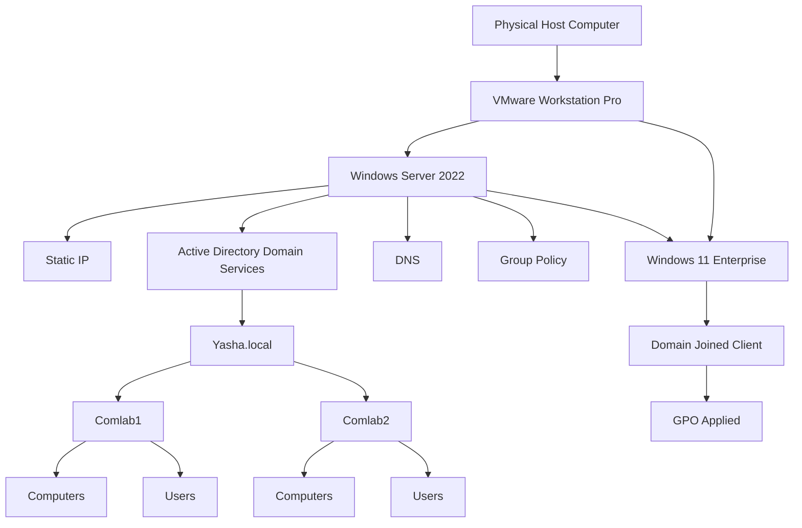

# Implementing Windows Server, AD DS, and GPO

A practical Windows Server laboratory project documenting the implementation of **Windows Server 2022**, **Active Directory Domain Services (AD DS)**, **DNS**, and **Group Policy Objects (GPOs)** using **VMware Workstation Pro** and a **Windows 11 Enterprise** client.

> **Project type:** Technical report + step-by-step laboratory guide  
> **Primary audience:** Students, IT practitioners, and IT instructors/professors

## Project Overview

This project documents the development of a virtualized Windows Server laboratory environment. The laboratory uses one Windows Server 2022 virtual machine as the Domain Controller and one Windows 11 Enterprise virtual machine as the client.

The main goal is to build a functional Windows domain environment and demonstrate how centralized administration can be used to manage computers in a computer laboratory.

The implementation covers:

- Deployment of Windows Server 2022 using VMware Workstation Pro.
- Configuration of a static IP address for the Windows Server.
- Installation of Active Directory Domain Services and promotion of the server to a Domain Controller.
- Creation of the `Yasha.local` Active Directory domain.
- Organization of the domain using `Comlab1` and `Comlab2` Organizational Units, each containing `Computers` and `Users` OUs.
- Creation of user accounts associated with the laboratory computers.
- Deployment and configuration of a Windows 11 Enterprise client.
- DNS configuration and domain connectivity testing.
- Joining the Windows 11 client to the `Yasha.local` domain.
- Implementation of Group Policy for desktop, password, and Control Panel management.
- Verification of Group Policy application using Windows administrative commands.

## Laboratory Architecture



## Project Environment

| Component | Configuration |
|---|---|
| Virtualization Platform | VMware Workstation Pro |
| Server OS | Windows Server 2022 |
| Client OS | Windows 11 Enterprise |
| Domain | `Yasha.local` |
| Domain Controller | Windows Server 2022 |
| Server IP | `[PLACEHOLDER]` |
| Client IP | `[PLACEHOLDER]` |
| DNS Server | `[PLACEHOLDER]` — Windows Server IP |
| Main OUs | `Comlab1`, `Comlab2` |
| Child OUs | `Computers`, `Users` |
| Implemented GPOs | Desktop, Password, Control Panel |

## Documentation Structure

1. **[Introduction and Project Scope](docs/01-introduction.md)**
2. **[Technologies and Core Concepts](docs/02-technologies-and-concepts.md)**
3. **[Laboratory Environment and Planning](docs/03-environment-and-planning.md)**
4. **[Windows Server Implementation](docs/04-windows-server-implementation.md)**
5. **[Active Directory Domain Services Implementation](docs/05-ad-ds-implementation.md)**
6. **[Windows 11 Client Implementation](docs/06-windows-client-implementation.md)**
7. **[Group Policy Implementation](docs/07-gpo-implementation.md)**
8. **[Testing and Verification](docs/08-testing-and-verification.md)**
9. **[Troubleshooting and Issues](docs/09-troubleshooting.md)**
10. **[Lessons Learned and Conclusion](docs/10-lessons-learned-and-conclusion.md)**

> Screenshots will be added later to the relevant sections. Screenshot locations are marked clearly so the actual laboratory evidence can be inserted without changing the documentation structure.

## Key Implementation Flow

```text
VMware Workstation Pro
        │
        ▼
Windows Server 2022
        │
        ├── Configure Static IP
        ├── Install AD DS
        ├── Promote to Domain Controller
        ├── Create Yasha.local
        └── Configure OUs
                │
                ▼
          Windows 11 Enterprise
                │
                ├── Configure DNS
                ├── Test Connectivity
                ├── Join Yasha.local
                └── Verify Domain
                        │
                        ▼
                 Group Policy
                        │
              ┌─────────┼─────────┐
              ▼         ▼         ▼
           Desktop   Password  Control Panel
            Policy     Policy     Policy
```

## Learning Focus

The project was studied and implemented over approximately **one to two weeks**, with emphasis on the Windows Server technologies most relevant to computer laboratory administration.

The learning focus was intentionally practical rather than attempting to cover every Windows Server feature. The main areas were:

- Windows Server administration and server roles.
- Active Directory Domain Services and Domain Controllers.
- DNS and its role in Active Directory communication.
- Organizational Units, users, and computers.
- Domain joining and client authentication.
- Group Policy and centralized configuration.
- Basic testing and troubleshooting of domain services.

## Official Resources

- [VMware Workstation Pro installation resource](https://knowledge.broadcom.com/external/article?articleNumber=368667)
- [Windows Server 2022 Evaluation](https://www.microsoft.com/en-us/evalcenter/evaluate-windows-server-2022)
- [Windows 11 Enterprise Evaluation](https://www.microsoft.com/en-us/evalcenter/evaluate-windows-11-enterprise)

## Documentation Status

- [x] Repository initialized
- [x] Project scope defined
- [x] Laboratory architecture defined
- [x] Server/client environment documented
- [x] Detailed implementation chapters drafted
- [ ] Screenshots and laboratory evidence
- [ ] Actual testing results filled in
- [x] Troubleshooting guide drafted
- [x] Lessons learned and conclusion drafted
- [ ] Final documentation review after screenshots are added

## Author

**Liam**  
Windows Server / AD DS / GPO Laboratory Project
