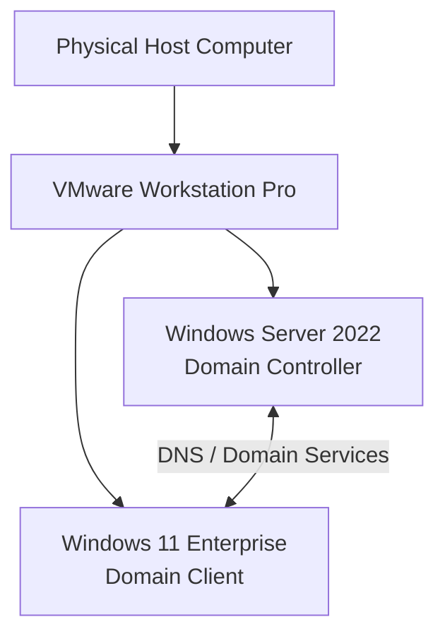

# 3. Laboratory Environment and Planning

Before configuring Active Directory and Group Policy, the laboratory environment was planned so that the server, client, domain, DNS, and OU structure would have a clear relationship.

## 3.1 Virtual Laboratory Design

The laboratory uses VMware Workstation Pro to host two virtual machines:

- **Windows Server 2022** — the central server and Domain Controller.
- **Windows 11 Enterprise** — the domain-joined client computer.

The design intentionally uses one server because the objective is to learn and demonstrate the core relationship between a Domain Controller and a Windows client in a controlled laboratory environment.



## 3.2 Server Configuration Plan

The Windows Server is intended to provide stable services to the client. A static IP address is therefore planned for the server rather than allowing its address to change dynamically.

The actual network values are intentionally left as placeholders until the laboratory values are recorded:

| Setting | Value |
|---|---|
| Server IP Address | `[PLACEHOLDER]` |
| Subnet Mask / Prefix | `[PLACEHOLDER]` |
| Default Gateway | `[PLACEHOLDER]` |
| Preferred DNS | `[PLACEHOLDER]` |
| Domain | `Yasha.local` |
| Server Role | Domain Controller |

A static server address provides a predictable destination for DNS and domain services. If the Domain Controller's address changes unexpectedly, clients may have difficulty locating the server or resolving the domain correctly.

## 3.3 Client Configuration Plan

The Windows 11 Enterprise client is configured to use the Windows Server as its preferred DNS server before attempting to join the domain.

| Setting | Value |
|---|---|
| Client Computer Name | `[PLACEHOLDER]` |
| Client IP Address | `[PLACEHOLDER]` |
| Subnet Mask / Prefix | `[PLACEHOLDER]` |
| Default Gateway | `[PLACEHOLDER]` |
| Preferred DNS | `[Windows Server IP - PLACEHOLDER]` |
| Domain | `Yasha.local` |

The exact client addressing method can be recorded here once the final laboratory configuration is documented.

## 3.4 Domain Naming

The Active Directory domain created for the project is:

```text
Yasha.local
```

The domain name provides the namespace used by the Windows clients and Active Directory objects in the laboratory.

## 3.5 Organizational Unit Planning

The OU structure was planned around the two computer laboratories:

```text
Yasha.local
│
├── Comlab1
│   ├── Computers
│   └── Users
│
└── Comlab2
    ├── Computers
    └── Users
```

The separation provides a logical structure for managing the two laboratories. Computer objects are kept in `Computers` OUs and user accounts are kept in `Users` OUs within their corresponding laboratory.

## 3.6 User Planning

User accounts were created for the laboratory computers and organized in the appropriate `Users` OU.

The exact account naming convention can be recorded in the final evidence section. For example, if a consistent naming scheme was used, the documentation should show representative names without exposing unnecessary credentials or sensitive information.

> **Security note:** Passwords and other authentication secrets should never be committed to the GitHub repository. Use placeholders when documenting credentials.

## 3.7 Group Policy Planning

The Group Policy implementation was planned around common problems in a shared computer laboratory. The goal is to protect the intended configuration while avoiding unnecessary restrictions.

The implemented policy categories are:

| Policy | Purpose |
|---|---|
| Desktop Policy | Standardize the desktop wallpaper and prevent users from changing it. |
| Password Policy | Apply the password-related controls configured for the laboratory. |
| Control Panel Policy | Restrict selected configuration areas such as User Accounts and Network and Sharing Center. |

The policy design follows the principle of applying controls to the appropriate scope rather than changing every computer manually.

## 3.8 Implementation Order

The planned implementation order was:

1. Install and prepare VMware Workstation Pro.
2. Install Windows Server 2022.
3. Configure the Windows Server network settings and static IP.
4. Install AD DS.
5. Promote the server to a Domain Controller and create `Yasha.local`.
6. Create the `Comlab1` and `Comlab2` OU structure.
7. Create the required user accounts.
8. Configure Windows 11 Enterprise.
9. Configure the client DNS to use the Windows Server.
10. Test server connectivity and DNS resolution.
11. Rename and join the Windows 11 client to `Yasha.local`.
12. Configure and link the Desktop, Password, and Control Panel GPOs.
13. Force a Group Policy refresh and verify the applied settings.

This order is important because later steps depend on services configured earlier. For example, the client cannot reliably join the domain until the Domain Controller and DNS are functioning.

## 3.9 Evidence Plan

Screenshots will be added later to document the actual implementation. Recommended evidence points include:

- VMware virtual machine configuration.
- Windows Server network configuration.
- Server Manager and AD DS installation.
- Domain Controller promotion and `Yasha.local` creation.
- Active Directory Users and Computers showing the OU structure.
- Windows 11 DNS configuration.
- Successful connectivity and `nslookup` results.
- Domain membership confirmation.
- Group Policy Management configuration.
- `gpupdate /force` and `gpresult /r` results.
- Final desktop and restricted Control Panel results.

> **Screenshot placeholder:** Insert the first VMware Workstation Pro laboratory screenshot here.

## 3.10 Planning Considerations

The laboratory was designed as a learning environment, so simplicity and repeatability were prioritized. One Domain Controller is sufficient to demonstrate the required concepts, while the virtualized client provides a controlled target for testing domain membership and GPO behavior.

The design can be expanded later by adding more client virtual machines, additional OUs, security groups, additional GPOs, or a second Domain Controller for redundancy.
