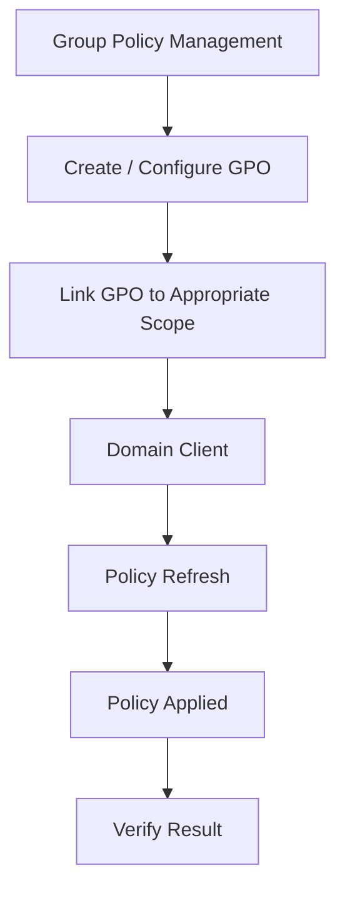

# 7. Group Policy Implementation

Group Policy was the final major configuration stage of the laboratory. The objective was to centrally control selected Windows settings so that shared laboratory computers maintain a consistent and manageable configuration.

## 7.1 Why Group Policy Was Used

In a computer laboratory, many different students may use the same computers. Without centralized controls, users can change settings that affect the next user or create additional administrative work.

Group Policy provides a central mechanism for applying consistent settings.

The implementation focuses on three policies:

1. **Desktop Policy**
2. **Password Policy**
3. **Control Panel Policy**

The policies are designed around actual laboratory administration concerns rather than attempting to restrict every possible Windows feature.

## 7.2 GPO Implementation Flow



## 7.3 Desktop Wallpaper Policy

### Purpose

The Desktop Policy standardizes the wallpaper used by laboratory computers and prevents users from changing it.

The policy addresses the recurring problem of students changing shared computer wallpapers, which can result in inconsistent laboratory configurations and additional administrative work.

### Expected behavior

The desired result is:

```text
                    Domain / OU
                        │
                        ▼
                 Desktop Wallpaper GPO
                        │
              ┌─────────┼─────────┐
              ▼         ▼         ▼
            PC 01     PC 02     PC 03
              │         │         │
              └──── Same Wallpaper ────┘
```

### Configuration approach

The policy is configured through Group Policy Management and targeted at the appropriate user or computer scope used by the laboratory.

The wallpaper source should be stored in a location that the intended domain clients can access. The exact file path used in the laboratory should be recorded below when screenshots are added:

```text
Wallpaper Source: [PLACEHOLDER]
GPO Name: [PLACEHOLDER]
GPO Scope / Linked OU: [PLACEHOLDER]
```

### Expected result

After the policy is applied:

- The configured wallpaper appears on the client.
- Users cannot replace it through the normal Windows personalization controls.
- Laboratory computers maintain a consistent appearance.

> **Screenshot placeholder:** Group Policy setting showing the wallpaper configuration.
>
> **Screenshot placeholder:** Windows 11 client showing the applied wallpaper.

## 7.4 Password Policy

### Purpose

A password policy was implemented as an additional laboratory control. Its purpose is to establish consistent password-related settings and reduce problems caused by users changing passwords in a shared laboratory environment.

The policy can address settings such as password complexity, length, history, or age depending on the configuration selected for the laboratory.

### Important security consideration

Password policies should be designed carefully. In a production environment, users should normally be allowed to manage their credentials according to the organization's identity and security requirements. Preventing password changes entirely is not a universal security best practice.

For this project, the password policy is documented as a **laboratory-specific administrative control** intended to reduce password-related access problems on shared computers.

### Laboratory configuration

The exact password settings used should be recorded from the actual Group Policy configuration:

```text
GPO / Policy Name : [PLACEHOLDER]
Minimum Password Length : [PLACEHOLDER]
Password Complexity : [PLACEHOLDER]
Password History : [PLACEHOLDER]
Maximum Password Age : [PLACEHOLDER]
Other Settings : [PLACEHOLDER]
```

> **Screenshot placeholder:** Password Policy settings as configured in the laboratory.

## 7.5 Control Panel Policy

### Purpose

The Control Panel Policy restricts selected configuration areas that students should not modify on shared laboratory computers.

Only specific areas were targeted rather than completely blocking access to all Windows configuration options.

The selected areas are:

- **User Accounts**
- **Network and Sharing Center**

## 7.6 User Accounts Restriction

The User Accounts area is restricted to prevent students from changing or deleting user-related configuration that should remain under administrator control.

This helps reduce the possibility of:

- Accidental deletion of accounts.
- Unwanted changes to user configuration.
- Changes that interfere with the intended laboratory setup.
- Additional troubleshooting caused by unauthorized account changes.

> **Screenshot placeholder:** GPO configuration used to hide/restrict User Accounts.
>
> **Screenshot placeholder:** Windows 11 client showing the resulting restriction.

## 7.7 Network and Sharing Center Restriction

The Network and Sharing Center is restricted because network configuration is important to the domain environment.

Students changing network settings could potentially modify the DNS configuration, IP settings, or other network parameters required for domain communication.

The restriction helps prevent accidental changes such as:

- Changing the preferred DNS server.
- Modifying the intended IP configuration.
- Disconnecting the computer from the expected network.
- Creating a condition where the client cannot locate the Domain Controller.

> **Screenshot placeholder:** GPO configuration used to restrict Network and Sharing Center.
>
> **Screenshot placeholder:** Windows 11 client showing the resulting restriction.

## 7.8 Applying the Group Policies

After configuring the GPOs, the client was instructed to refresh its Group Policy configuration.

The command used was:

```cmd
gpupdate /force
```

`gpupdate /force` forces Windows to refresh and reapply Group Policy settings immediately rather than waiting for the normal background refresh cycle.

The process is:

```text
Administrator changes GPO
        │
        ▼
Domain Controller
        │
        ▼
gpupdate /force
        │
        ▼
Windows 11 Client
        │
        ▼
Policies refreshed
        │
        ▼
Settings applied
```

After the policy refresh, the client was restarted to ensure that the configured settings took effect where a restart was required.

> **Screenshot placeholder:** Command Prompt showing successful `gpupdate /force`.

## 7.9 Verifying Applied Policies

The command below can be used to display a summary of the policies applied to the current computer and user:

```cmd
gpresult /r
```

`gpresult /r` reports the Resultant Set of Policy information for the current user and computer, helping confirm which Group Policy objects were processed.

The verification should confirm that the expected GPOs are being applied.

> **Screenshot placeholder:** `gpresult /r` output showing the implemented GPOs.

## 7.10 GPO Testing Matrix

| Policy | Test | Expected Result |
|---|---|---|
| Desktop | Check Windows desktop | Configured wallpaper appears. |
| Desktop | Attempt to change wallpaper | User cannot change the managed wallpaper. |
| Password | Review configured password settings | Laboratory password requirements match the configured policy. |
| Control Panel | Open User Accounts | Area is restricted/hidden according to the GPO. |
| Control Panel | Open Network and Sharing Center | Area is restricted/hidden according to the GPO. |
| All GPOs | Run `gpresult /r` | Expected GPOs appear in the applied policy results. |

## 7.11 Optional Future Policy: Website / URL Blocking

Website or URL blocking was considered as a possible future improvement but is not part of the implemented GPO set documented in this project.

A future implementation could address access to inappropriate or unnecessary websites, but the exact approach depends on the browser, Windows version, and management method selected.

It is therefore kept as a future enhancement rather than presented as an implemented feature.

## 7.12 GPO Implementation Checklist

- [ ] Desktop Wallpaper GPO created and configured.
- [ ] Desktop Wallpaper GPO linked to the intended scope.
- [ ] Wallpaper applied successfully on the client.
- [ ] Wallpaper change restriction verified.
- [ ] Password Policy configured according to the laboratory design.
- [ ] Password Policy behavior verified.
- [ ] User Accounts restriction configured.
- [ ] Network and Sharing Center restriction configured.
- [ ] `gpupdate /force` executed.
- [ ] Client restarted where required.
- [ ] `gpresult /r` used for verification.
- [ ] Final policy behavior tested on the Windows 11 client.

The next chapter documents the testing and verification process for the complete laboratory environment.
