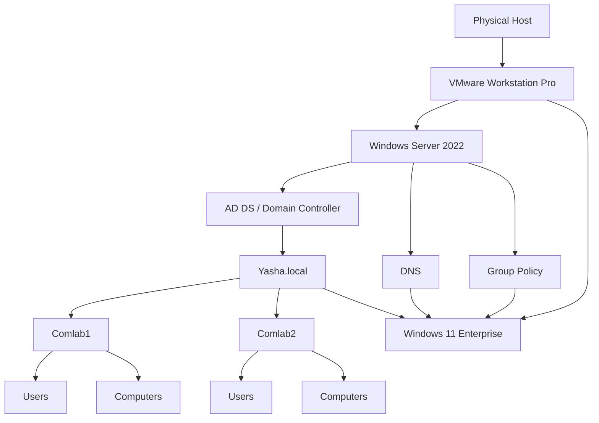

# 10. Lessons Learned and Conclusion

## 10.1 Lessons Learned

The project provided practical experience with the relationship between virtualization, Windows Server, Active Directory, DNS, domain clients, and Group Policy.

The major lessons were:

- **Windows Server provides centralized services.** Instead of treating every laboratory computer as an independent system, the server provides a central point for identity and management.
- **AD DS provides centralized identity management.** Users and computers can be organized and managed within the `Yasha.local` domain.
- **DNS is fundamental to Active Directory.** Correct DNS configuration is necessary for clients to locate domain services and successfully participate in the domain environment.
- **Organizational Units provide structure and policy scope.** The `Comlab1` and `Comlab2` structure makes the environment easier to organize and provides a logical scope for future policies.
- **Group Policy reduces repetitive administration.** Instead of manually configuring every client, settings can be defined centrally and applied to domain computers and users.
- **Testing is part of implementation.** Commands such as `ipconfig /all`, `nslookup`, `gpupdate /force`, and `gpresult /r` help verify whether the intended services and policies are actually working.

## 10.2 Laboratory-Specific Policy Design

The implemented GPOs were selected based on common problems that can occur in shared computer laboratories.

The Desktop Policy standardizes the appearance of the computers and prevents students from repeatedly changing the wallpaper. The Password Policy addresses the laboratory's need for controlled password management. The Control Panel Policy restricts selected areas that could cause configuration or domain connectivity problems if changed by students.

These policies should be understood as controls designed for this laboratory environment. In a production organization, policies should be reviewed against security requirements, user needs, operational procedures, and organizational policy before deployment.

## 10.3 Project Limitations

The laboratory intentionally uses a small architecture with one Windows Server 2022 Domain Controller and one Windows 11 Enterprise client. It demonstrates the core concepts but does not represent a highly available production environment.

The project does not currently demonstrate:

- Multiple Domain Controllers or Active Directory redundancy.
- Large-scale client deployment.
- Enterprise backup and disaster recovery.
- Advanced security monitoring.
- A complete web-filtering or URL-blocking implementation.

These can be considered future improvements.

## 10.4 Future Improvements

Possible extensions include:

- Adding additional Windows 11 client virtual machines to better simulate a real computer laboratory.
- Creating security groups for more granular management.
- Developing laboratory-specific GPOs for `Comlab1` and `Comlab2`.
- Adding more detailed security and account policies.
- Implementing and testing website or URL restrictions using an appropriate management method.
- Adding backup and recovery procedures for the Domain Controller.
- Introducing a second Domain Controller to demonstrate redundancy.

## 10.5 Final Laboratory Architecture

## 10.6 Conclusion

The project established a functional Windows Server laboratory environment using VMware Workstation Pro, Windows Server 2022, Windows 11 Enterprise, Active Directory Domain Services, DNS, and Group Policy.

The Windows Server was configured as the Domain Controller for `Yasha.local`. The Active Directory structure was organized into `Comlab1` and `Comlab2`, with separate `Computers` and `Users` Organizational Units. User accounts were created for the laboratory computers, and a Windows 11 Enterprise client was configured to use the server for DNS and joined to the domain.

Group Policy was then used to provide centralized management. The implemented policies focused on desktop standardization, password management, and selected Control Panel restrictions. These controls were selected to address practical issues associated with shared laboratory computers and to reduce accidental configuration changes by students.

The project also demonstrated an important principle of Windows administration: the individual components depend on one another. VMware provides the virtual infrastructure, Windows Server provides the server platform, DNS helps clients locate services, AD DS provides centralized identity and domain management, Organizational Units provide structure, and Group Policy applies centralized configuration.

The result is a small but functional model of centralized Windows administration. Although the laboratory is not intended to represent a complete production environment, it provides a practical foundation for understanding how Windows Server, AD DS, DNS, and GPO work together in a computer laboratory.

## 10.7 Final Evidence Checklist

Before considering the GitHub documentation complete, add the actual laboratory evidence for:

- VMware Workstation Pro setup.
- Windows Server installation and static IP configuration.
- AD DS installation and Domain Controller promotion.
- `Yasha.local` and the complete OU structure.
- User accounts and computer objects.
- Windows 11 DNS configuration.
- Successful domain join.
- `nslookup Yasha.local` result.
- Desktop, Password, and Control Panel GPO configuration.
- `gpupdate /force` and `gpresult /r` results.
- Final client behavior demonstrating the implemented policies.

Do not add passwords, private credentials, recovery keys, or other sensitive information to the public repository.
